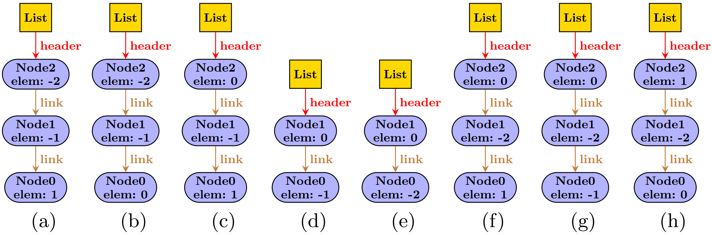
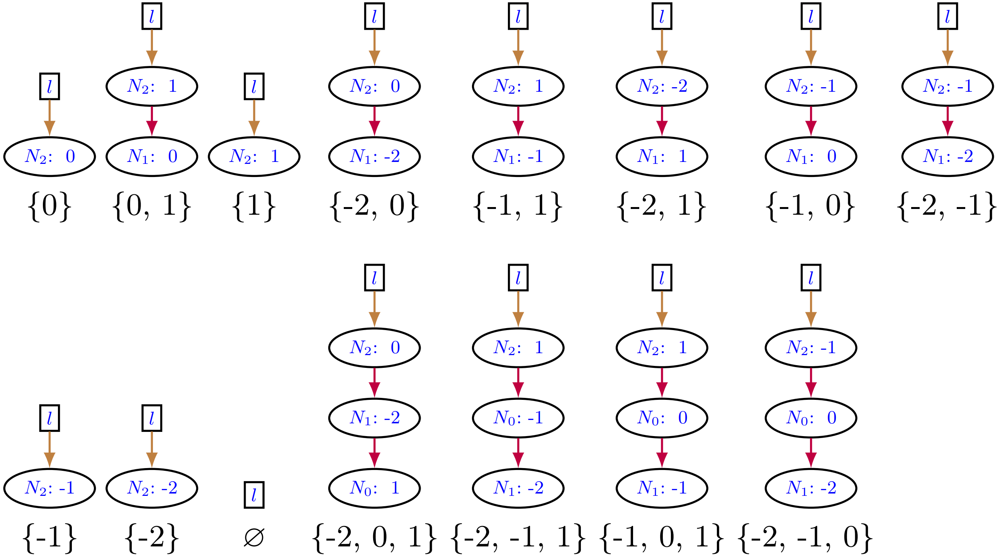

# Seabs: Solution Enumeration ABStraction 

`Seabs` is our Java-based implementation to guide solution enumeration for Alloy models using abstract functions. The abstract function defines data abstractions to enhance solution enumeration by specifying **how** the solutions must differ. As a result, the collection of solutions enumerated are of high quality to the user and of a manageable size.

# Requirements:

* Operating Systems
  - Linux (64 bit)
  - Mac OS (64 bit)

* Dependencies
  - Java 8: Must be installed and accessible from `PATH`.
  - Bash 4.4: Must be installed and accessible from `PATH`.
  - [Alloy4.2](https://github.com/AlloyTools/org.alloytools.alloy): Must be in the classpath.  `Seabs` comes with Alloy4.2
    under `libs/alloy4.2.jar`.
  - Commons CLI 1.0: Must be in the classpath.  `Seabs` comes with
    Commons CLI under `libs/commons-cli-1.0.jar`.

# Installation:

## Clone Seabs repo

To run `Seabs`, use `git` to clone the repository.

```Shell
git clone git@github.com:allisonius/Seabs.git
```

# Quick Start:

## Creating an Abstract Function

`Seabs` works with a user defined abstract function, which may be declared using the existing relations in the model or may require modeling additional signatures and relations (see our example models for inspiration on different types of abstract functions you may wish to define for your model). 

## Generating a KodKod Program Using the Abstraction Function

To generate a Java program which will instruct Alloy's backend, KodKod, to search for the next solution by applying an abstract function, run:
```Shell
./seabs.sh --generate -p <arg> -i <arg> [-c] [-k] [-q <arg>] [-o <arg>] [-r <arg>]
```
or use the full argument names:
```Shell
./seabs.sh --generate --pathIn <arg> --alloyModel <arg> [--countModels] [--createKodkodProgram] [--pathOut <arg>] [--kodkodProgram <arg>] [--absRels <arg>]
```
 * `-p,--pathIn`: This argument is required.  Pass the directory that the Alloy model is stored in.
 * `-i,--alloyModel`: This argument is required.  Pass the name of the Alloy model in the form `[name].als`.
 * `-c,--countModels`: This argument is optional.  Pass this argument if you want to count the number of solutions for the model without any abstract function applied.
 * `-k,--createKodkodProgram:` This argument is optional.  Pass this argument if you want to to generate a Java program which augments the standard Alloy enumeration at the KodKod level to use the abstract function to search for the next solution.
 * `-q,--pathOut`: This argument is optional.  Pass the directory where you want the Java program to be stored. 
 * `-o,--kodkodProgram`: This argument is optional.  Pass the name of the to-be-generated Java file.
 * `-r,--absRels`: This argument is optional.  Pass the relations which made up the abstract domain. If more than one relation, provide all relations as a comma-delimited list.

After a successful execution `[kodkodProgram name].java` will contain an executable Java program and be stored in the directory outlined by `-q/--pathOut`.

## Enumerating Solutions Guided by Abstract Functions

To use the generated Java program to actually guide solution enumeration, run:
```Shell
./seabs.sh --enumerate -p <arg> 
```
our use the full argument names:
```Shell
./seabs.sh --enumerate --pathIn
```
 * `-p,--pathIn`: This argument is required.  Pass the full path name of the Java program that was created by the generate command.
 
 By default, the execution will report the following:
  * Time to translate the problem into a cnf representation
  * The size of the Alloy model as the # variables, # primary variables, # clauses generated for the SAT call
  * The number of solutions found
  * Total solving time
  
 To display the textual representation of all the solutions enumerated, toggle `PRINT_SOLUTIONS` in `main/scr/java/solver/Solver.java` on line 23.
 
 ```Java
 ....
 22. /**Toggle this variable to true if you want to be able to view the generated solutions**/
 23. final static boolean PRINT_SOLUTIONS = false; 
 ....
  ```

## Included Examples

`Seabs` provides 15 example models along with associated base models, as needed. These examples coverage a range of different types of abstract functions (from *traditional* to *focused generation* to *symmetry breaking* to *modeling alternatives*). The
`experiments/models` directory contains all example models.

|    Model    | Base Model | Abstract Domain                                                                                 | Abstraction                                              |
|:-----------:|:----------:|-------------------------------------------------------------------------------------------------|----------------------------------------------------------|
|  objarrayAF |  objarray  | `AbsFun.af: set Object`                                                                         | Traditional - set of objects                             |
|    bstAF    |     bst    | `AbsFun.af: set Int`                                                                            | Traditional - set of integers                            |
|  minheapAF  |   minheap  | `AbsFun.af: set Int`                                                                            | Traditional - set of integers                            |
|    dllAF    |     dll    | `AbsFun.af: set Int`                                                                            | Traditional - set of integers                            |
|   dtreeAF   |    dtree   | `AbsFun.af: set Int`                                                                            | Traditional - set of integers                            |
|  listAF |  list  | `AbsFun.af: set Int`                                                                         | Traditional - set of integers                             |
|   graphAF   |    graph   | `AbsFun.af: Node x Node`                                                                        | Focused generation - transitive closure                  |
|   graphAF2  |    graph   | `AbsFun.af: Node x Node`                                                                        | Focused generation - reflexive transitive closure        |
|     bstp    |      -     | `Node.parent`                                                                                   | Focused generation - parent must differ                  |
|     rbt     |      -     | `RBT.root`, `RBT.size`, `Node.key`, `Node.left`, `Node.right`                                  | Focused generation - search tree must differ             |
| listsymbrAF |  listsymbr | `AbsFun.af1: List x Node`, `AbsFun.af2: Node x Int`, `AbsFun.af3: Node x Node`                    | Symmetry breaking - non-isomorphic structures            |
|  bstsymbrAF |  bstsymbr  | `AbsFun.af: set Int`                                                                            | Symmetry breaking and traditional                        |
|  multisetAF |  multiset  | `AbsFun.array: Int x Int`, `AbsFun.length: Int`                                                  | Modeling alternatives - sorted array of integers         |
|  graphsymAF |  graphsym  | `AbsFun.af: Event x Location x Event x Location`                                  | Modeling alternatives - map between (*E*,*L*) pairs      |
| graphsymAF2 |  graphsym  | `AbsFun.af1: Event x Location`, `AbsFun.af2: Event x Location x Event x Location` | Modeling alternatives - two maps to allow isolated nodes |

Relevant [recent work](https://github.com/ctrippel/checkmate) uses Alloy to model *micro-happens-before* graphs in the context of hardware modeling. This work introduced a number of custom techniques to reduce the number of solutions enumerated since each solution contributed to a security litmus test. One reduction the authors desired was to create one representative graph from each class that has the same transitive closure, which can be done using our technique (see `graphAF`, `graphAF2`, `graphsymAF` and `graphsymAF2` for two different variants of this idea). 

## Example usage
To run the list example, the following shell commands would be used:
```Shell
./seabs.sh --generate -p experiments/models -i ListAF.als -c -k -q output/ -o ListAF.java -r this/ABsFun,this/AnsFun.af
./seabs.sh --enumerate ...[location of Seabs].../Seabs/output/ListAF.java 
```

# Example 

## Alloy Model

Below, we show an [acyclic singly linked
list](experiments/models/list.als) Alloy model:
```Alloy
module list

one sig List { header: lone Node }
sig Node { elem: Int, link: lone Node }

pred Acyclic { /* no directed cycle */
  all n: List.header.*link | n !in n.^link }
  
pred NoRepetition { /* unique nodes have unique elements */
  all disj m, n: List.header.*link | m.elem != n.elem  }
  
pred RepOk { Acyclic and NoRepetition }

fact Reachability { List.header.*link = Node } /* no disconnected node */

run RepOk for 3 but 2 int
```

The model declares a set of `List` and `Node` atoms and constrains the `List` set to be a singleton.  Each `List` atom has zero or one `header` of type `Node`.  Each `Node` atom has zero or one following `Node` along `link`.  `header` and `link` are partial functions.  

The predicate `Acyclic` restricts the list to be acyclic.  The body of the `Acyclic` predicate states that the list is acyclic if all nodes (`n`) reachable from the `header`, including the header itself, are not reachable from themselves following one or more `link` traversals.

The predicate `NoRepetition` restricts the nodes in the list to have different elements. The body of `NoRepetition` uses a universally quantified formula to state that as long as two `Node` atoms are different (`disj`), then the value of their elements must also be different.

The predicate `RepOk` outlines that a valid list satisfies both `Acyclic` and `NoRepetition`.

The fact `Reachability` restricts all node atoms to be contained within the modeled list. (This fact paragraph helps simplify the overall list model.)

## Enumerated Alloy Solutions

Below is the first 8 solutions (of 42) enumerated by the Alloy Analyzer for the above list model for the command `run RepOk for 3 but 2 int`:



While these solutions are non-isomorphic, more than one solutions contain the same *set* of node values. For example, the two lists (f) and (h) represent the same set {-2, 0, 1} with 3 values. 

## Abstract Function
The following is one [abstract function](experiments/models/listAF.als) for the above list model. This abstract function makes the abstract domain sets of integers. When used to guide solution enumeration, this abstract function ensures lists consists of different sets of integers for the `elem` values.

```Alloy
module listAF
open list
one sig AbsFun { af: set Int }
fact AbsFunDef { AbsFun.af = List.header.*link.elem }
```
## Enumerated Solutions Guided by an Abstract Function
When the above abstract function is used to guide solution enumeration, the following 15 solutions are enumerated when the scope `3 but 2 Int` is used:



The set of `elem` values for each list are given below the graphical representation of the solution. Across **all** 15 solutions, **none** of these sets repeat.

# Publications 

* "Solution Enumeration Abstraction -- A Modeling Idiom to Enhance a Lightweight Formal Method."
    Allison Sullivan, Darko Marinov and Sarfraz Khurshid. *in The 21st International Conference on Formal Engineering Methods (ICFEM 2019).*

# License

MIT License, see `LICENSE` for more information.
